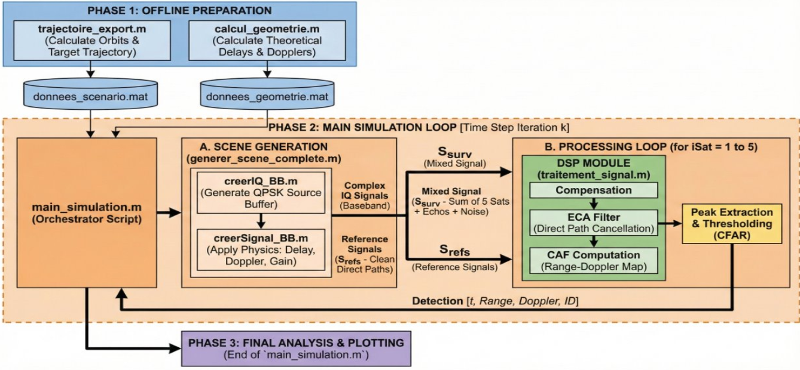
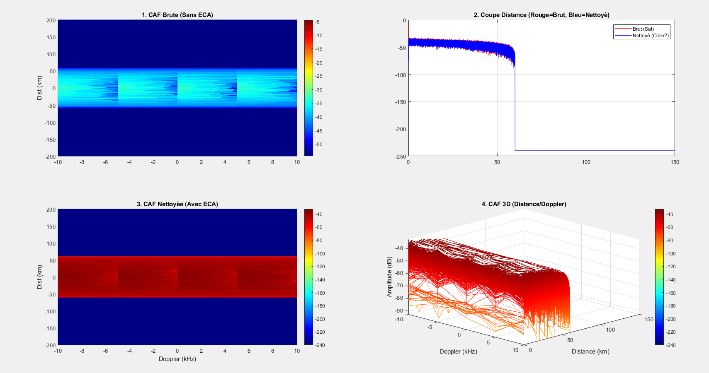
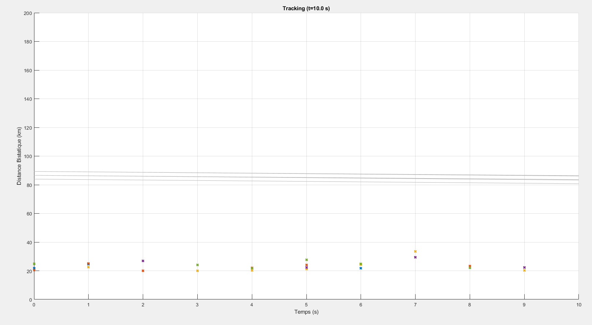

# simu_radar_passif_signaux_sat

### Simulation de Radar Passif sur signaux satellitaires

L'objectif ici est de modéliser une chaîne complète de détection radar passive qui exploite les signaux d'opportunité émis par des constellations de satellites en orbite basse pour repérer une cible. C'est une simulation dont le but est notamment de visualiser comment on peut extraire un écho radar très faible noyé dans le bruit et les interférences directes des satellites.

### Comprendre l'architecture :

Pour mieux saisir comment les différents scripts interagissent, voici le schéma global du fonctionnement de la simulation.

Comme illustré ci-dessus, le projet se divise en trois grandes phases logiques. Nous avons d'abord une phase de préparation où nous calculons toute la physique du scénario (la trajectoire de la cible et des satellites ainsi que que le calcul de la géométrie bistatique associée). Ces données sont sauvegardées et servent ensuite de base à la simulation principale.

La seconde phase est le cœur du système : c'est la boucle de simulation temporelle. À chaque instant, nous générons les signaux électromagnétiques bruts (mélange des signaux satellites, échos, bruit thermique), puis nous les passons dans notre module de traitement du signal. Ce module effectue la synchronisation, le nettoyage des interférences via l'algorithme ECA, et enfin le calcul de la corrélation croisée (CAF) pour détecter la cible.

**Hypothèses Simplificatrices du Modèle**

* La Terre est modélisée comme une sphère parfaite de rayon 6371 km, sans prise en compte de la rotation terrestre durant le temps d'intégration.
* La propagation des ondes s'effectue en espace libre, ignorant les atténuations atmosphériques et les trajets multiples parasites venant du sol (clutter).
* La cible est considérée comme un point unique isotrope avec une Surface Équivalente Radar constante (pas de fluctuation).
* On applique l'approximation Stop-and-Hop, considérant que la cible et les satellites sont figés durant le temps de trajet de l'onde.
* On suppose disposer au niveau du récepteur d'une copie propre et à fort SNR du signal direct du satellite visé, exempte de pollution par les échos.
* Les gains d'antenne sont considérés constants dans la direction de visée.

**Paramètres Clés de la Simulation**

* Source d'opportunité : Constellation de satellites en orbite basse (LEO) type OneWeb (altitude 1200 km).
* Nature du signal : Signal IQ généré directement en Bande de Base avec une modulation QPSK aléatoire.
* Nombre d'émetteurs : 5 satellites suivis simultanément pour la multilatération.
* Bande passante du signal : 240 MHz.
* Fréquence Porteuse : 11.7 GHz (Bande Ku).
* Scénario de Puissance : Simulation d'une forte dynamique entre le trajet direct (atténuation 100 dB) et le trajet écho (atténuation 140 dB).
* Géométrie : Cible aérienne évoluant à une distance bistatique comprise entre 80 km et 150 km.

**Installation et configuration**

Si vous récupérez ce projet depuis GitHub, la procédure pour le faire fonctionner sur votre machine est très simple. Il n'y a pas d'installation complexe requise, il vous faut juste MATLAB avec la Signal Processing Toolbox. Une fois que vous avez téléchargé le dossier (soit par clonage, soit via le bouton "Download ZIP"), décompressez-le à l'endroit de votre choix. Ouvrez ensuite MATLAB et naviguez jusqu'à ce dossier. La seule étape technique importante est de s'assurer que MATLAB "voit" bien tous les fichiers. Pour cela, faites un clic droit sur le dossier principal du projet dans l'explorateur de fichiers de MATLAB, et choisissez l'option pour ajouter le dossier et ses sous-dossiers au chemin (Add to Path > Selected Folders and Subfolders). Cela évitera les erreurs de fonctions introuvables.

### Comment lancer la simulation

Pour que la simulation fonctionne, il est impératif de respecter un ordre précis d'exécution des programmes. En effet, chaque étape dépend des données calculées par la précédente.

**Pour tout lancer d'un coup :</u>**

Si vous voulez tout lancer ou relancer de zéro sans vous soucier de l'ordre, vous pouvez aussi simplement exécuter le script TOUT_LANCER.m qui automatisera toute la séquence pour vous.

**Pour lancer les programmes un à un et les voir fonctionner individuellement :**

Vous devez commencer par lancer le script `Trajectoire.m`. Son rôle est de mettre en place le décor : il définit la position du récepteur au sol, simule le mouvement de la constellation de satellites et fait voler l'avion cible à travers la scène. Il va créer un fichier de données contenant toutes ces coordonnées. Si vous voulez visualiser spécifiquement les trajectoires générées vous pouvez lancer `Trajectoire_visu.m`.

Ensuite, exécutez `calcul_geometrie.m`. Ce programme reprend les positions générées juste avant pour calculer les retards de propagation et les décalages Doppler théoriques. C'est une étape intermédiaire essentielle pour préparer le travail du processeur radar. Si vous voulez, vous pouvez lancer après le test unitaire `test_calcul_geometrie.m`. Ce dernier se place dans une situation simple : 1 seul satellite au-dessus du radar et compare les résultats obtenu avec ce qu'on devrait obtenir. Néanmoins, ce test écrase les donnés du fichier `donnees_scenario.mat`, donc après son exécution il faut relancer les programmes du début pour avancer dans la simulation. (Si ce programme renvoie une erreur stipulant qu'un fichier est manquant, il faut add to path le fichier `1_scenario_physique spécifiquement`)

Une fois ces deux étapes de préparation terminées, il est possible de lancer `test_generation_signal.m`. C'est un script de validation qui permet de vérifier que la génération des signaux est réaliste avant de lancer la grosse simulation. Il va générer des graphiques comme celui ci-dessous :

Ce test visuel est rassurant : on y voit à gauche la constellation QPSK propre du satellite source (le carré bleu), et à droite le signal mélangé reçu par l'antenne (le nuage rouge), qui montre bien que le signal utile est totalement noyé dans le bruit et les interférences des autres satellites. C'est tout le défi du traitement qui va suivre.

Enfin, pour voir le radar en action, `lancez main_simulation.m`. C'est le chef d'orchestre qui va traiter le signal seconde par seconde, afficher les cartes de détection distance-Doppler et tracer la position de l'avion en temps réel.

### Explication des programmes non-mentionnés ci-dessus :

`creerIQ_BB.m` est chargé de fabriquer la source numérique pure du signal satellite avant son émission. Il génère une suite de données aléatoires qu'il module en format QPSK puis filtre pour obtenir une forme d'onde réaliste et respectant la bande passante définie. Son utilité est de fournir une référence parfaite, ou empreinte digitale, que le radar cherchera ensuite à détecter.

`creerSignal_BB.m` simule physiquement le voyage de l'onde électromagnétique dans l'espace pour un trajet donné. Elle prend le signal source et le modifie mathématiquement en lui appliquant un retard temporel précis, un décalage fréquentiel dû à l'effet Doppler et une atténuation de puissance. Elle est essentielle pour distinguer le trajet direct court et puissant du trajet écho long et faible réfléchi par la cible.

`generer_scene_complete.m` assemble l'environnement électromagnétique global que reçoit l'antenne de surveillance à un instant précis. Il boucle sur tous les satellites visibles pour additionner leurs signaux directs, leurs échos sur la cible et ajoute par-dessus un bruit de fond thermique. C'est lui qui crée le défi technique en noyant le signal utile de l'avion sous une masse d'interférences et de bruit.

`traitement_signal.m` constitue le cerveau du radar qui analyse les données reçues pour extraire l'information. Il réalise successivement la compensation de la vitesse du satellite, le nettoyage du signal direct via le filtre ECA et enfin le calcul de la corrélation croisée. Son rôle final est de produire une carte en deux dimensions où l'énergie de la cible ressort sous forme d'un pic visible, indiquant sa distance et sa vitesse.

`calcul_position_cible.m` est l'outil mathématique qui transforme les mesures brutes du radar en une localisation géographique concrète. Il prend en entrée les distances bistatiques détectées par au moins trois satellites différents ainsi que leurs positions orbitales exactes à cet instant. Comme l'intersection de plusieurs ellipsoïdes dans l'espace est complexe à résoudre par une simple équation, ce script utilise un algorithme d'optimisation qui teste intelligemment plusieurs positions possibles jusqu'à trouver celle qui correspond le mieux à toutes les mesures simultanément. Son utilité est donc de convertir une série de retards temporels abstraits en coordonnées X, Y et Z précises, permettant de passer d'une simple détection de présence à un positionnement réel de l'avion dans l'espace.

### Analyse des résultats :

La simulation parvient à générer un scénario cohérent, incluant la trajectoire des satellites, la géométrie bistatique et la synthèse des signaux IQ. Cependant, les résultats obtenus en sortie de chaîne de traitement mettent en évidence la difficulté majeure du radar passif, à savoir la gestion de l'interférence du trajet direct. Actuellement, le signal reçu directement depuis le satellite est plusieurs ordres de grandeur plus puissant que l'écho réfléchi par la cible, créant un effet de masquage important sur les soixante premiers kilomètres de la carte distance-Doppler.

Le principal problème se situe au niveau de l'algorithme d'annulation des interférences (ECA). Bien que ce filtre soit conçu pour projeter le signal de surveillance dans un sous-espace orthogonal au signal de référence, son implémentation actuelle ne parvient pas à supprimer totalement les lobes secondaires du signal direct. Il reste un résidu de puissance, visible sous la forme d'un bloc dense sur les graphiques, qui est supérieur au niveau de puissance de la cible. Le radar détecte donc ce bruit résiduel comme étant des cibles potentielles, ce qui engendre des fausses alarmes et empêche la détection de l'avion situé plus loin.

En conséquence, l'étape de tracking ne peut pas fonctionner correctement. Le détecteur extrait les pics d'énergie correspondant aux résidus d'interférence au lieu de l'écho de l'avion. Ces fausses détections étant aléatoires et incohérentes d'un satellite à l'autre, l'algorithme de multilatération géométrique ne peut pas trouver d'intersection commune aux ellipsoïdes de distance. C'est la raison pour laquelle le positionnement 3D de la cible n'aboutit pas et que les graphes de suivi montrent des points dispersés à courte distance.

Pour améliorer ces performances dans une version future, l'effort devrait se concentrer sur le perfectionnement du nettoyage du signal de référence. L'utilisation d'un filtre adaptatif plus complexe, tel qu'un filtre RLS (Recursive Least Squares) ou l'augmentation significative de l'ordre du filtre ECA, permettrait de creuser davantage sous le plancher de bruit. De plus, l'implémentation d'un détecteur CFAR (Constant False Alarm Rate) plus robuste permettrait d'ignorer dynamiquement les zones de forte interférence pour aller chercher les pics plus faibles mais cohérents de la cible réelle.

